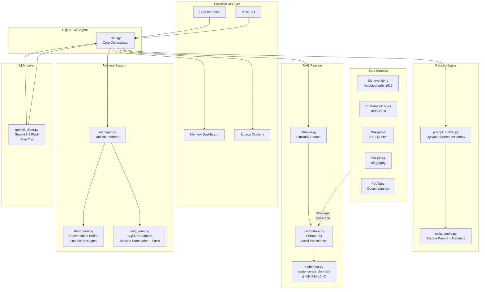
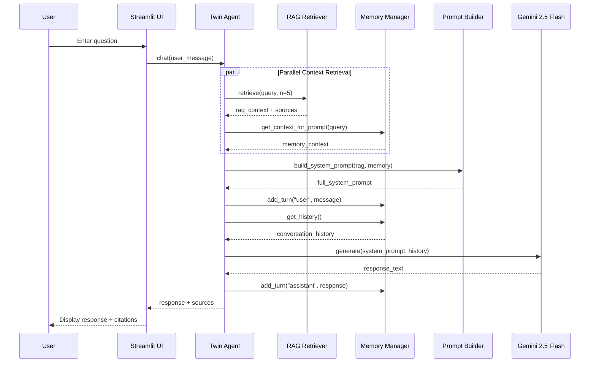

# Architecture — Digital Twin of Nikola Tesla

## System Architecture Diagram

## Data Flow

### Query Processing (per user message)

## Component Details

### 1. Persona Layer
The persona is the creative core. `tesla_config.py` contains:
- **System prompt**: ~3000 tokens of detailed personality, speech patterns, epistemic style, teaching methods
- **Timeline awareness**: Knowledge cutoff at January 1943
- **Metadata**: Biographical facts, institutions, notable works

### 2. RAG Pipeline
- **Embedder**: Uses `all-MiniLM-L6-v2` (384 dimensions) for fast, local embeddings
- **Vector Store**: ChromaDB with cosine similarity, persistent local storage
- **Retriever**: Returns top-5 relevant chunks with formatted source labels

### 3. Memory System
- **Short-term**: Rolling buffer of last 20 messages within a session
- **Long-term**: SQLite database storing session summaries, topics, and entities
- **Summarization**: Uses Gemini to generate structured summaries at end of each session

### 4. LLM Integration
- Gemini 2.5 Flash via Google AI Studio free tier
- 15 requests per minute, 1500 per day
- System instruction support for persona injection
